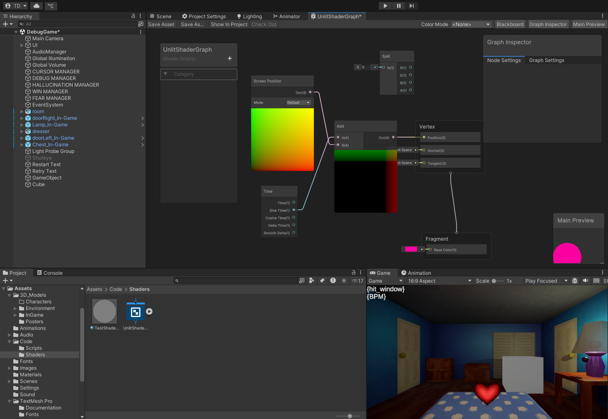

# PPJ 11 - Thomas Deolall
04/24/2025

## Tasks
 - 1 hr: Created outline for randomized visual/auditory events dependent on fear level.
 - 1 hr: Messed around with shaders

## Blog
The horror aspect of our game has largely been ignored for the most part up until now. However, since we are now in the refinement stage, the horror-side of the game can finally get some more love. As discussed with the team, I've created a rough outline of how these "scare" events will play out. One will play after a random amount of time, though more frequently at higher fear levels. More potent and scarier ones will play at higher fear levels as well, and so my code reflects this. 

## Image(s)

## Milestones
N/A

## Looking Ahead
I'll finish tidying up my logic for the "scare" events so that the team can add to and expand upon it. After that is complete, I can put most of my focus on the shaders I want to create.
