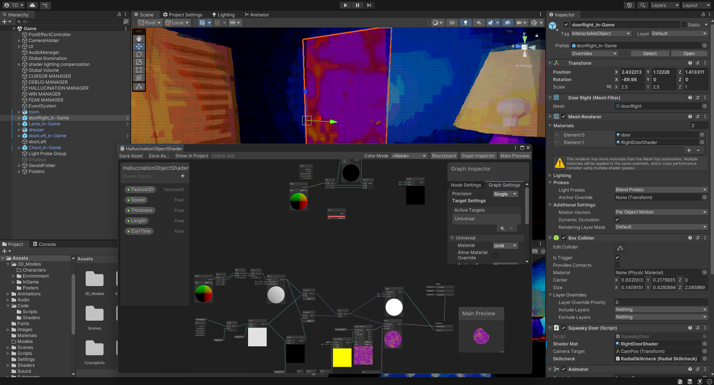

# PPJ 12 - Thomas Deolall
05/01/2025

## Tasks
 - 2 hours: Created shader for hallucination events
 - 2 hours: Created structure for random, "red herring" events

## Blog
This week I created a shader for the hallucination objects. This was my first time using Unity's shader graph, and I can now say that I do not like visual scripting. For me, I find it even more clunky to find the nodes that I want, and despite my shader being quite simple compared to other shaders, I feel like it's already turned into spaghetti. But I'm sure people have the exact same complaints about text-based code, so it's all just personal preference. Still, I'm very proud of how the shader turned out. I think it looks nice and I like how animated it is.
Another thing I worked on is the structure for "red herring" events. It's fairly easy to implement more of these events into the code, so I think I'll ask the whole team for ideas or clean up the code a little bit for them to add to it without much resistance themselves.

## Image(s)

## Milestones
Personal Milestone 3 was due at the same time as this PPJ. In all honesty, I am not as satisfied with my work compared to previous milestones. I had barely done anything extra beyond the contract, and my excuse for fulfilling my "nice-to-have features" deliverable is mediocre at best. However, I am still quite happy with the main deliverables on my contract, those being the "red herring" events and shaders.

## Looking Ahead
I may want to clean up the "red herring" logic for the team so that they can build off of it as well. Something that I wanted to add before the personal milestone was a bit of camera movement, such as a light head bobbing or camera shake during a high intensity moment. Unfortunately, this requires a large restructure of the code, which is why I couldn't implement it in time. So, I think I'll work on implementing this now with less time pressure.
