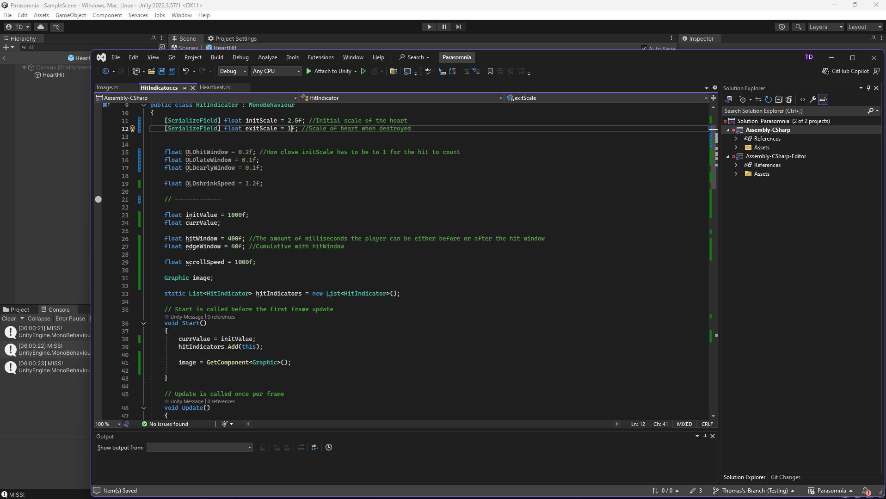
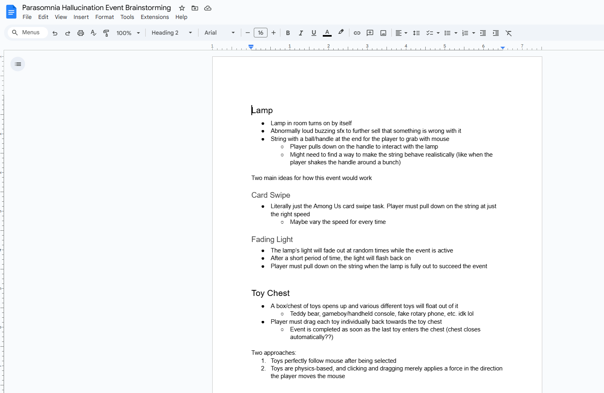

# PPJ 3 - Thomas Deolall
02/20/2025

## Tasks
- 0.5 hr: Brainstormed the specifics for the microgames for each hallucination event in a Google Doc
- 1 hr: Revised heartbeat system to allow timing windows to be independent of the scale of the hit indicator (still needs work)
- 1 hr: Began work on the camera functionality for selecting a hallucination event.

## Blog
This week, I mostly expanded upon the code that I worked on last week. As I mentioned before, I am trying to revise the hit detection system to be independent of the scale of the hit indicators. Ideally, I want a variable that denotes the exact milliseconds for how early/late you can hit and still stay on beat, as I know that this is how hit detection systems work for the rhythm games that I've played before. I am close to finding a solution, though I believe that I have an issue with either converting between units or scales. For example, I have a value that starts high and counts down, and if it's within the hit window range, you successfully hit the beat. If the value is positive, you hit it early, if it's negative you hit it late. When that value is at 0, theoretically the hit indicator's visual should be at a scale of 1. But right now, it just... isn't. 
Unfortunately, I'm not super satisfied with how much I accomplished this week. I had difficulties finding the time to work on the project due to other classes and ran into a lot of issues with my code. There were several logic problems that I couldn't grasp my head around, which really slowed my progress. 

## Image(s)

## Milestones
N/A

## Looking Ahead
The coming weeks should be more of the same. I should be able to resolve my issues with the heartbeat system and reach a final version of it fairly soon. After that, I'll work more on the camera functionality and get it to a functional state so that I can work on the first hallucination event.
