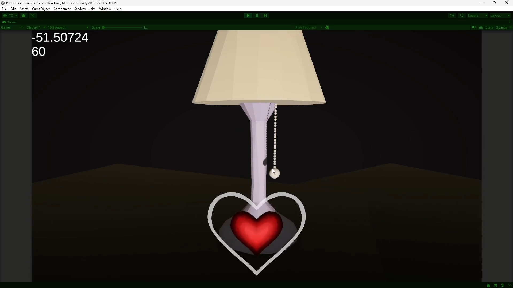

# PPJ 4 - Thomas Deolall
02/27/2025

## Tasks
- 1 hr: Team meeting
- 1.5 hr (Studio Time): Worked on project and discussed with Paulo on how to integrate the sound effects
- 3 hr: Created lamp functionality, win/loss logic and transition
- 2 hr: Expanded upon the heartbeat system, adding a regeneration system and early/late windows

## Blog
Perhaps it was the pressure of Milestone 1 this week, but I think I accomplished a lot! The first hallucination event is pretty much entirely in place. I'm currently using Daniel's first pass of the lamp model, though we are planning to update it to Michael's newer model soon (definitely before the alpha build). I'm very happy with how the chain turned out. It was daunting at first, but Unity's HingeJoint components did a lot of the heavy lifting and logic that I originally thought I was going to have to code on my own.
While I did write down that I was going to help with the title screen in my milestone 1, Denise was able to handle it on her own. I do plan to help with the options menu, especially the logic for all of the options on the title screen.

## Image(s)

## Milestones
Individual Milestone 1: Adding on to what was said in the blog, most of what I did this week was finishing up requirements for my milestone 1. While I didn't get to contribute much to the title screen portion that I noted down, I plan to work on the options menu with Denise soon.

## Looking Ahead
Paulo and I need to work together on integrating his sounds to play at the right times for the lamp and heartbeat. I'll have to update the lamp model to Michael's new one soon. I'd also like to begin work on the next hallucination event, which is going to be the toy chest in the room that'll have a bunch of toys flying out of it, and the player will have to drag them back into the chest. Come to think of it, that logic shouldn't be that different from the ball and chain on the lamp!
