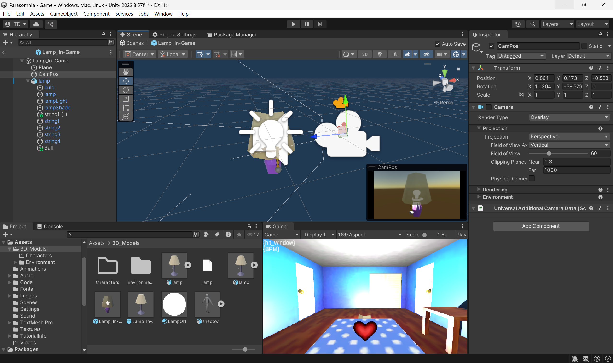

# PPJ 5 - Thomas Deolall
03/06/2025

## Tasks
- 1 hr: Team meeting, worked on merging branches
- 1.5 hr: Worked on moving the lamp logic onto the new lamp model, started on making a debug menu for easier playtesting and presenting for the alpha build.

## Blog
Merging branches went quite smoothly, and we didn't have any conflicts on GitHub. The more concerning issue turned out to be working with Michael's models in my Unity scene, but still this isn't that big of a problem. The room turned out to be a lot smaller than I thought within Unity, but after minimizing the scene camera's clipping planes, it was not that big a deal. The models aren't centered with the anchor point within Unity, which I believe is caused by the models not being centered within the Blender scene?? I'm not super familiar with Blender, but this is my best guess. Regardless, I'm sure we can sort this out during studio time. There's also no ball at the end of the chain for the player to grab on this model, so I just used a temporary ball and will swap it out soon. 
I hope this doesn't come off as me complaining, because truthfully I am not. I think these issues highlight an issue of communication on my end. I could be more clear with what I need from the assets beforehand. The whole team is also just unfamiliar with how well Blender files convert into Unity, so there's bound to be a few hiccups along the way.

## Image(s)

## Milestones
N/A

## Looking Ahead
Again, Michael and I just need to iron out the few hiccups from the merge. I began working on a debug menu just to simply disable the heartbeat/hallucinations during game, as well as adding time and instantly starting a hallucination event. It's currently very barebones right now, but I'll finalize it before our presentation on Tuesday next week.
