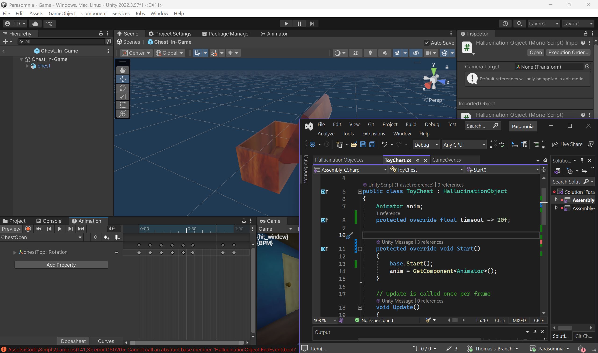

# PPJ 6 - Thomas Deolall
03/13/2025

## Tasks
- 3-4 hr: Team meeting, worked with Denise to prepare Unity project and slides for alpha build presentation
- 1 hr: Started working on toy chest hallucination event

## Blog
Originally I had wanted to make a sort of debug menu prior to the alpha build. However, a combination of not getting things to work and a time crunch with other, more important things to prioritize led me to push it off. Hopefully, I'll have a system in place for the beta presentation.
I started on the second hallucination event; the toy chest. I'm confident that making this event should be just as easy as making the lamp, as I can borrow quite a lot of functionality from the previous hallucination event. So far, I only have the animation of the chest opening and an outline of its script created.

## Image(s)

## Milestones
The alpha build presentation was just this last Tuesday. I feel that the team and I hit pretty much all of the marks that we had written into our contract. There are a few weak points in what we accomplished, such as the audio as well as the fear system not being as developed as I'd like it. Regardless, I'm quite proud of what we've been able to do thus far.

## Looking Ahead
I'd first like to finish the toy chest hallucination event. But after it's done, I'd like to put all of my efforts into developing the fear level system. Ideally, as the player's fear increases, the hallucination events should get more difficult. I already spent a little bit of time looking into how I can change the lamp script to accomplish this, and it feels like I'm going to need to make quite a lot of changes. So, the earlier I address this, the less I'll have to redo later on.
