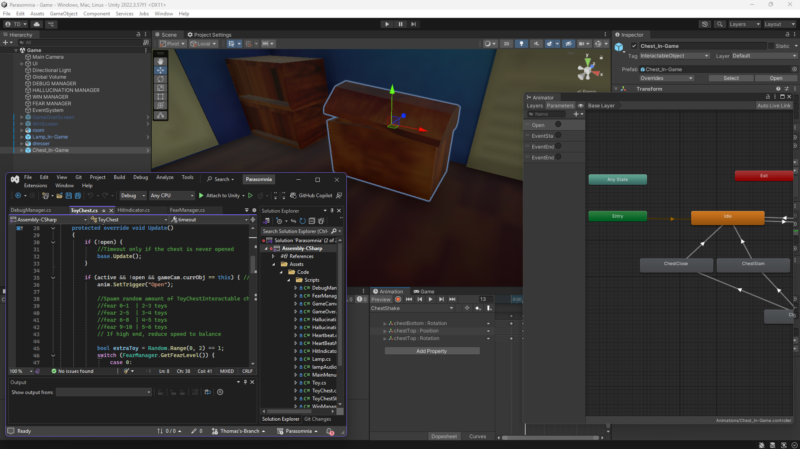

# PPJ 7 - Thomas Deolall
03/27/2025

## Tasks
- 1 hr (Studio Time): Worked on animations for toy chest hallucination event
- 1.5 hr: Team meeting, worked on logic for toy chest
- 3 hr: Worked on toy chest, new lamp logic, fear level scaling

## Blog
Over spring break and during this week, I was able to get the toy chest working how I want it. I'm quite happy with the shaking animation as a visual indicator for the event beginning. So far, I've made the lamp and chest animations within Unity. It's been working well for very simple animations of rotations and position changes, though I'm sure making them in Blender would be the better approach.

I also made the hallucination events scale in difficulty with fear level. I primarily accomplished this with several AnimationCurves. You may see in my Milestone 2 video submission that the toy chest and lamp scripts have a green animation curve, which I read the values from to get scale the events with the fear level. I'm unsure how common this approach is, but I've used this same approoach a ton in one of my old personal projects. I like how it more visually illustrates the way my numbers are scaling, as well as how quickly and easily I'm able to alter it. It's much easier than trying to decipher a big function.

## Image(s)

## Milestones
The individual milestone 2 is due at the same time as this PPJ. I've talked quite a bit about what I did for this milestone in the blog portion. Another thing I did for refining the heartbeat script that I hadn't mentioned in the video was that there was a bug where extremely early hits still counted, meaning that you can get away with simply spamming the keyboard and hitting the beats as soon as they spawned in. The problem seemed to be that I left an extra function call that destroyed the hit indicator object as if it were hit by the player. Also, around the area I found that function call, I found 2 'foreach' statements that just didn't have brackets after them. How they just sat there for over a month, never once sending me a syntax error is beyond my knowledge.

## Looking Ahead
Our audio for the game is still busted, but Paulo and Denise just got the sound scriptable object in place. Now, it's just a matter of merging our branches together and swapping out some function calls to get the audio working properly across the entire game.
The toy chest is supposed to spawn more toys than just the teddy bear. I still need to code the logic to randomly select other toys for the event.
