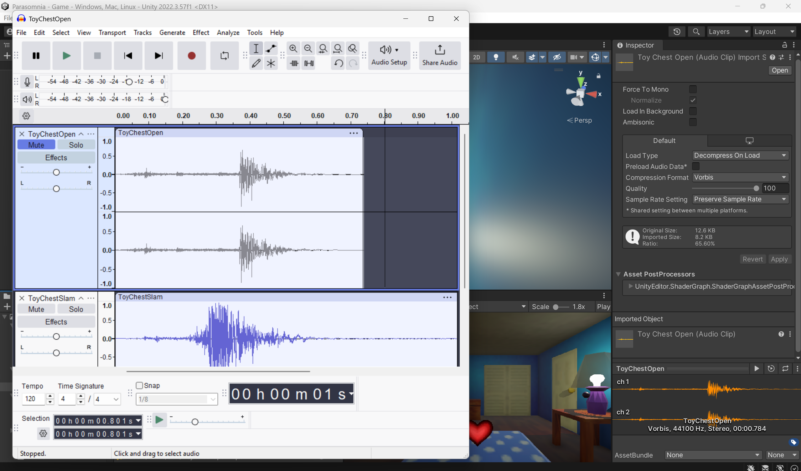

# PPJ 8 - Thomas Deolall
04/03/2025

## Tasks
- 1.5 hr: Created and added sound effects to the toy chest
- 1.5 hr: Team meeting, discussed parts of the game that need to be done before our playtest build, added functionality for randomizing extra toy models for the toy chest

## Blog
After Paulo and Denise created the sound scriptable object, I was able to use it to add sounds for my chest. I found it surprisingly easy to comprehend and use. It was basically just a function call! I also worked on randomizing what toys come out of the chest, instead of it always being the teddy bear. I set it up so that no toy can appear twice for the same event. Though thinking about it now, I should probably stop using the old implementation of instantiating and destroying the toys, and instead just keep them hidden somewhere in the scene. It'd be slightly better performance-wise and also clean up the code a bit.

## Image(s)

## Milestones
N/A

## Looking Ahead
After what was discussed in our team meeting, I need to get to work on setting up the game for the playtest. That includes some sort of tutorial segment, a better lighting system to better show that morning is approaching, and overall just a few things to enhance the ambience and game feel.
