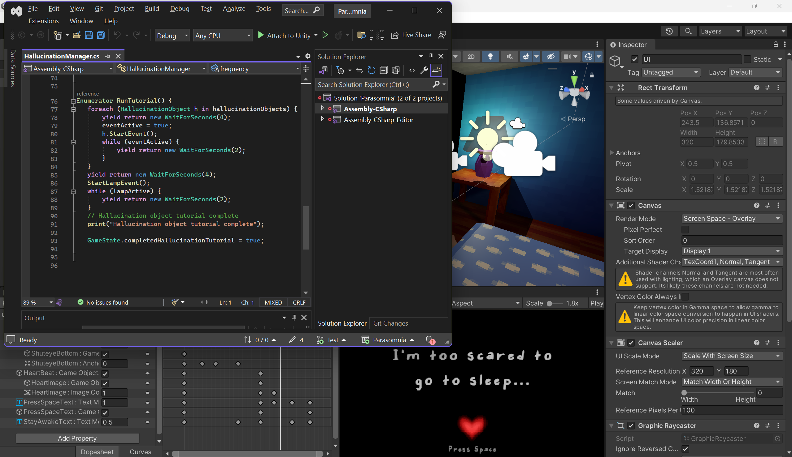

# PPJ 9 - Thomas Deolall
04/08/2025

## Tasks
- Yeah I lost track of how many hours I worked on the tutorial segment lol, did it across like 2 or 3 days
- 1.5 hr: Playtesting
- 1.5 hr (Studio time): Worked on 
- 1 hr: Team meeting, finalized last bits of the beta build
- 0.5 hr: Linked up Michael's animations for Gerald (shadow guy) to play at correct times, added new toys to toy chest

## Blog
In preparation for our playtest, Denise and I thought it would be a good idea to start implementing "readability" features that would better communicate the objectives of the game. This way, we would get more information out of the playtesters than just just "I don't know what to do" (though admittedly, a lot of this did still happen). I decided to implement a tutorial segment where the player can become familiar with each of the hallucination events in a risk-free environment. This took quite a lot of my time, but I'm very happy with how it turned out and the large leap in progress this sprint gives us.

## Image(s)

## Milestones
We had the first playtest report due on Tuesday of this week. Some things inevitably went wrong, but that was absolutely to be expected. Our restart functionality was broken, but only in the built WebGL version. The Unity project functioned completely normally. So basically I have absolutely no idea what's wrong and don't know how to go about troubleshooting it! :)))
The beta build was due today. We're missing a few things off of our contract, but I feel that we've also added a lot more content that isn't listed on the contract, mainly the tutorial segment and decorative elements/ambience. So I'm still quite happy with the progress we've made so far. Some of the deliverables on the contract was touched on in some amount, but nowhere near where we want them to be.

## Looking Ahead
I want to work on improving these weak deliverables, primarily the feedback of mechanics portion. I'd also like to see the ambience of the game improve a lot more, with ambient sounds and visual effects. I think that last bit of juicing and polishing will really help tie the game together.
