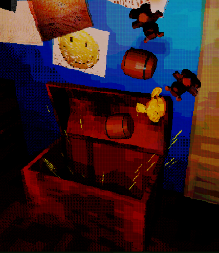
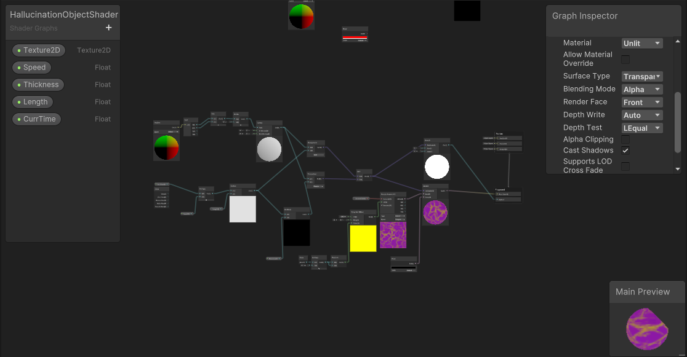
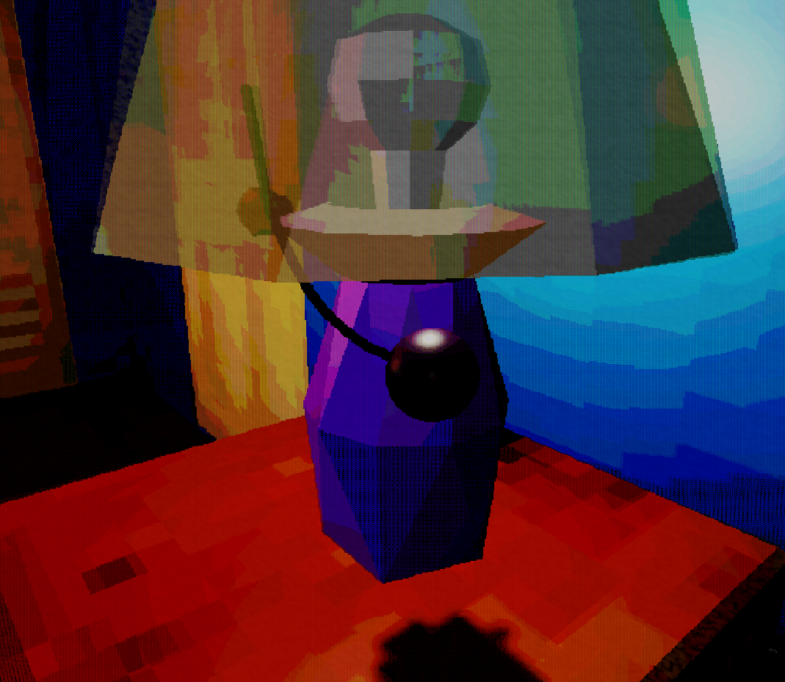

# Final PPJ - Thomas Deolall
05/14/2025

## Tasks
As the lead programmer, I was responsible for a lot of the backend logic, among other things. I made:
- Overall logic for handling hallucination events
- Toy chest and lamp event
- Logic for heartbeat mechanic
- Logic for the fear level system
- Night progression and win/lose system
- The full tutorial segment
- Logic for the red herring events
- Shader for starting a hallucination event

## Positives
  Honestly, I'm very happy that we ended with what truly feels like a finished product. Nothing in the main game feels incomplete, and I really like how the models and visuals turned out in the game. As this is my first time truly working on a project in a team setting, I learned a lot about project management, how to document my code for others to work off of, and more. I also learned a lot about how to use GitHub through this course, which I've already been able to apply to other projects and hobbies.

## Negatives
  Working in a team is hard! We had several communication issues, and we've all went radio-silent on the team at least once each. I especially don't think I was very good in communicating, as outside of when it was brought up in meetings, I would rarely update my team on what I've been working on. I think that I wouldn't give frequent updates because I'd feel embarrassed by how little I was able to accomplish, but even then, I feel like a small update on what's been going on is better than literally nothing at all. 

  Perhaps it was due to a lack of familiarity with how the softwares interact, but there were definitely some issues with models imported from Blender into Unity. Objects anchored in weird places, the default light and camera sneaking in with the model, scaling issues, and more. I'm sure it's just something that comes with experience, because eventually this became a non-issue by the end of the semester.

## Gallery

